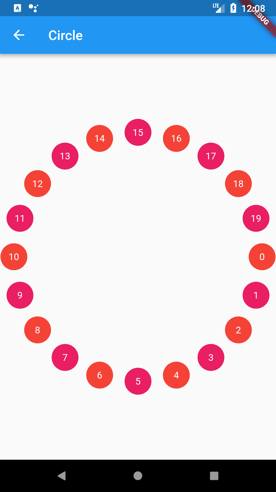
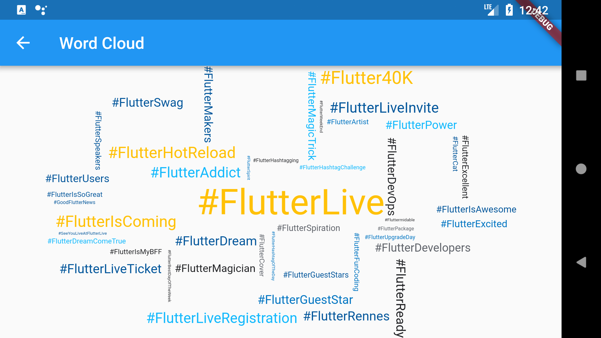
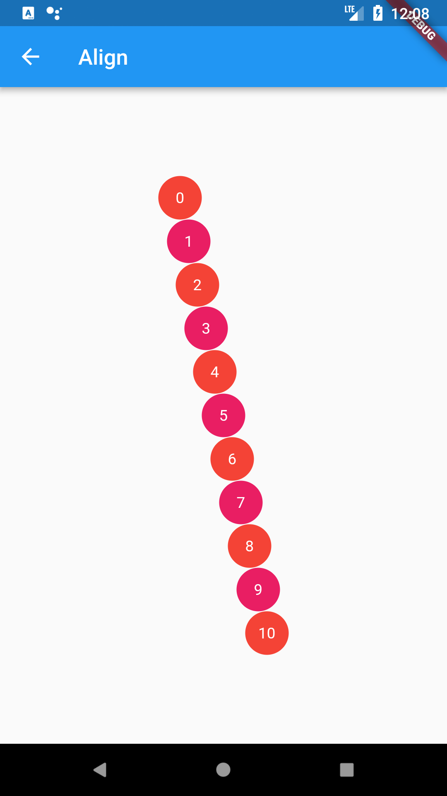
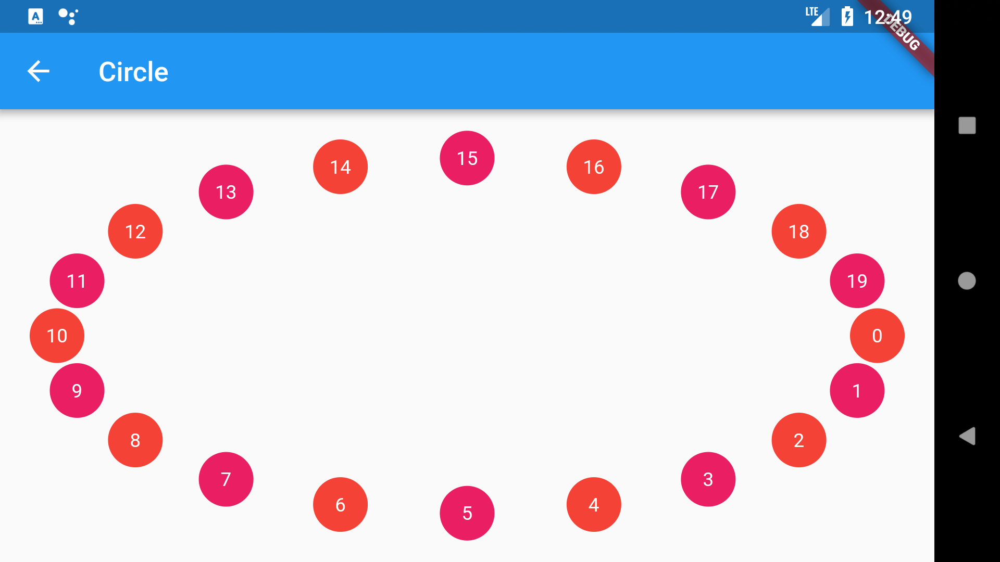

# flutter_scatter

A widget that displays a collection of dispersed and non-overlapping children.

[](https://pub.dartlang.org/packages/flutter_scatter)
[](https://www.paypal.com/cgi-bin/webscr?cmd=_s-xclick&hosted_button_id=QTT34M25RDNL6)

Can be used to create word clouds:


## Features

* Built-in delegates (Spirals, Align, Ellipse).
* Allow you to specify how to align chlidren.

## Getting started

In the `pubspec.yaml` of your flutter project, add the following dependency:
The latest version is [](https://pub.dartlang.org/packages/flutter_scatter)

```yaml
dependencies:
  ...
  flutter_scatter: ^latest_version
```

In your library add the following import:

```dart
import 'package:flutter_scatter/flutter_scatter.dart';
```

For help getting started with Flutter, view the online [documentation](https://flutter.io/).

## Widgets

You can simply create a `Scatter` by providing a delegate and a list of widgets.

The delegate is responsible for computing positions.
For example if you want to position your widgets on a circle, you will use the `EllipseScatterDelegate`:

```dart
return Center(
    child: Scatter(
    delegate: EllipseScatterDelegate(
        a: 185.0,
        b: 185.0,
        step: 1.0 / count,
    ),
    children: widgets,
    ),
);
```



It may be useful to choose how children are aligned with the computed positions. By default, the center of the widgets will be placed on the positions generated by the delegate.
If you want to be left aligned, you will change the `alignment` argument of the `Scatter` to be `Alignment.topLeft`.

By default, the Scatter will not try to fill gaps (for performance reasons). You can override this behavior by setting the `fillGaps` argument to `true`.

For example this is what the above word cloud would look if the `fillGaps` argument would be set to `false`:


## Delegates

`Scatter` has built-in delegates which can be highly parameterized:

### Spirals

* ArchimedeanSpiralScatterDelegate
* FermatSpiralScatterDelegate
* LogarithmicSpiralScatterDelegate


### Alignments

* AlignScatterDelegate



### Ellipses

* EllipseScatterDelegate



## Examples

You can find more examples in this [app](https://github.com/letsar/flutter_scatter/tree/master/example).

## Changelog

Please see the [Changelog](https://github.com/letsar/flutter_scatter/blob/master/CHANGELOG.md) page to know what's recently changed.

## Contributions

Feel free to contribute to this project.

If you find a bug or want a feature, but don't know how to fix/implement it, please fill an [issue](https://github.com/letsar/flutter_scatter/issues).  
If you fixed a bug or implemented a new feature, please send a [pull request](https://github.com/letsar/flutter_scatter/pulls).
